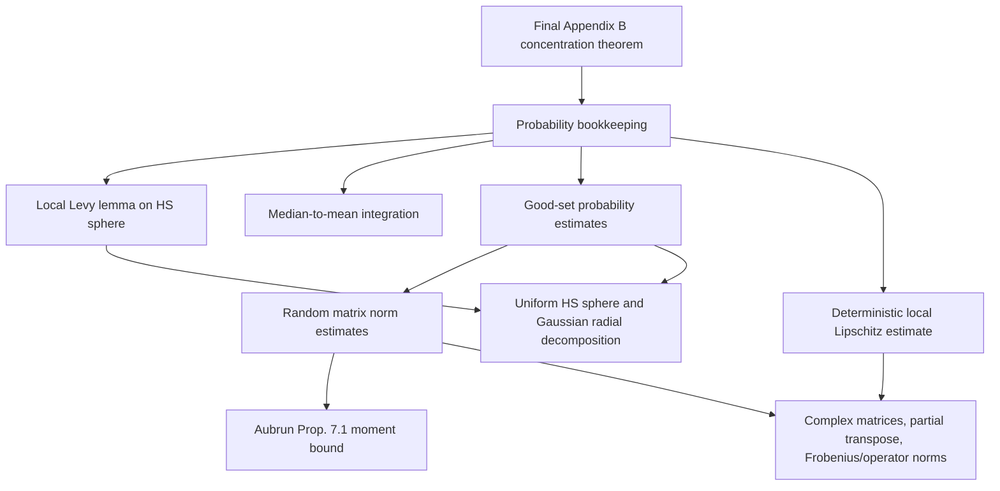

# Appendix B Lean formalization map

This file records what is now formalized in
`PptFactorization/AppendixB.lean`, what is still only an analytic input, and
which parts of the Erdos 524 Lean repos are relevant to an eventual fully
axiom-free certification.

## Current target

The LaTeX theorem to mirror is in
`/Users/kieranmcshane/Documents/Claude/Projects/Article PPT/main_cm_details.tex`,
lines 2149-2168:

```text
P(|f_k(X) - E f_k(X)| >= epsilon / d^(2k-2))
  <= C exp(-c d^2) + C exp(-c d^4 epsilon^2 / k^2).
```

The proof route in the paper is:

1. Work on the Hilbert-Schmidt sphere
   `S_HS(d^2,s) = { X in M_{d^2,s}(C) : ||X||_2 = 1 }`.
2. Prove deterministic local Lipschitz control for
   `f_k(X) = Tr((((X X*)^Gamma))^k)` on a good set.
3. Prove the good set has complement at most `2 exp(-c d^2)`.
4. Apply a localized Levy lemma on the real sphere of dimension
   `n = 2 d^2 s ~ d^4`.
5. Integrate the median tail to pass from median to expectation.

## What `AppendixB.lean` now certifies

The Lean file currently proves the bookkeeping layer, not the random-matrix
analysis.  The new paper-facing layer introduces these manuscript names:

| Lean name | Paper meaning |
| --- | --- |
| `sphereDimension d s` | real dimension `2 d^2 s` of the HS ambient space |
| `naturalDeviationScale d eps r` | deviation `eps / d^(2r-2)` |
| `localLipschitzScale C momentParameter d r` | local Lipschitz scale `C k / d^(2r-2)` |
| `localLevyExponent n t L` | Levy exponent `n t^2 / (4 L^2)` |
| `targetLocalExponent c d eps k` | target exponent `c d^4 eps^2 / k^2` |
| `goodSetTail c d` | `exp(-c d^2)` |
| `paperTailBound K cSphere cLocal d eps k` | final two-term tail bound |

The strongest current wrapper is:

```lean
theorem paper_local_lipschitz_concentration_from_integrated_centering_and_scales
```

Compared with the first scaffold, this no longer assumes the exponent
comparison or the good-set union bound.  Lean now proves:

- the deterministic median-to-mean event inclusion;
- the probability-level monotonicity from that inclusion;
- the layer-cake estimate converting an integrated median tail into a
  quantitative mean-median bound;
- the union bound from the two estimates on `Omega_1` and `Omega_2`;
- the scale computation
  `n ~ d^4`, `t = epsilon / d^(2r-2)`, `L = C k / d^(2r-2)`
  implies the target exponent `c d^4 epsilon^2 / k^2`, provided
  `c <= cDim / (4 C^2)`;
- the half-scale version needed after centering at the mean, with
  `c <= cDim / (16 C^2)`.

The interface also now contains:

```lean
theorem trace_power_bound_from_telescope_terms
theorem trace_power_bound_from_telescope_and_hs_op_controls
theorem deterministic_frobenius_lipschitz_from_operator_and_difference_bounds
theorem deterministic_frobenius_lipschitz_from_telescoping_terms
theorem deterministic_frobenius_lipschitz_from_hs_op_telescope_controls
```

This is the preferred deterministic route for the paper: it uses an abstract
Frobenius/Hilbert-Schmidt norm and a dimension factor for
`|Tr M| <= dimensionFactor ||M||_HS`, rather than routing the argument through
a trace-norm placeholder.  The deepest wrapper no longer assumes the
trace-power perturbation estimate as a single black box.  It reconstructs it
from:

- the telescoping expansion of `Tr(A^k)-Tr(B^k)`;
- trace controlled by Hilbert-Schmidt norm;
- Hilbert-Schmidt/operator-norm product control;
- operator-norm bounds for powers of the two matrices.

The final branching step is isolated as:

```lean
theorem paper_local_lipschitz_concentration_with_centering_or_trivial_branch
theorem paper_local_lipschitz_concentration_with_explicit_small_branch
```

It records the exact proof split in the manuscript: in the large-deviation
case the median-to-mean inclusion gives `meanTail <= medianTail`; in the
small-deviation case the final constant is enlarged so that the right-hand
side is at least `1`, and the trivial probability bound closes the estimate.
The explicit version replaces the raw `RHS >= 1` hypothesis by the checkable
condition `targetLocalExponent <= log K`.

The remaining hypotheses are therefore closer to the actual analytic
lemmas in the paper, not raw final-form inequalities.

Build status:

```text
lake build PptFactorization.AppendixB
Build completed successfully (3264 jobs).
```

## Axiom-free dependency graph

An actually full formalization breaks into the following dependency blocks.



### Block B: probability bookkeeping

Status: essentially done in `PptFactorization/AppendixB.lean`.

Already formalized:

- union bound for `Omega = Omega_1 cap Omega_2`;
- comparison of the abstract Levy exponent with the target
  `d^4 eps^2 / k^2`;
- median tail plus good-set tail;
- deterministic event inclusion from median to mean;
- absorption of numerical constants into one `K`.

Remaining work here is cosmetic: once Blocks C to J exist, replace the
abstract real-valued inputs in `PaperConcentrationInputs` by actual
probabilities of events.

### Block C: local Levy lemma on the HS sphere

Mathematical input needed:

If `Omega subset S^{n-1}` has measure at least `3/4`, and `h|_Omega` is
`L`-Lipschitz, then for a median or central value,

```text
P(|h - M_h| >= t) <= 2 P(Omega^c) + 2 exp(- n t^2 / (4 L^2)).
```

The attached Aubrun-Szarek book gives the right roadmap:

- Chapter 5, Section 5.2.1: concentration on the sphere and Levy's lemma.
- Chapter 5, Section 5.2.2: Gaussian concentration.
- The book explicitly treats the sphere and Gaussian space as closely linked,
  including the classical passage from high-dimensional sphere projections to
  Gaussian space.

Important correction to the conceptual framing:

The Hilbert-Schmidt sphere is not fundamentally exotic.  As a real Hilbert
space, `M_{d^2,s}(C)` is just `R^(2 d^2 s)` with its canonical Euclidean scalar
product.  The difference is mostly formal-library engineering: a direct proof
needs sphere measure and Levy lemma infrastructure, while a Gaussian proof
would need Gaussian Lipschitz concentration plus radial normalization.

Lean gap:

Mathlib has useful Gaussian distribution infrastructure, but no ready-made
Levy lemma on `Metric.sphere`, no sphere isoperimetry, and no packaged local
McShane-extension concentration theorem.  This is a real formalization block.

### Block D: median-to-mean integration

Mathematical input:

From

```text
P(|f_k - M_k| >= u) <= 4 exp(-c d^2)
  + 2 exp(-c d^4 u^2 / L_k^2)
```

and `|f_k| <= 1`, prove

```text
|E f_k - M_k| <= C exp(-c d^2) + C L_k / sqrt(n)
              <= C(k,lambda) d^(-2k) + C exp(-c d^2).
```

Lean status: closed at the bookkeeping level in
`PptFactorization/AppendixB.lean`.

The following are formalized:

```lean
mean_median_gap_from_integrated_tail
mean_deviation_implies_median_deviation
mean_tail_probability_le_median_tail_probability
mean_tail_probability_le_median_tail_probability_from_integrated_tail
appendixB_mean_concentration_from_integrated_centering
paper_local_lipschitz_concentration_from_integrated_centering_and_scales
```

What remains is not the logical median-to-mean step itself.  The first
remaining input is the one-dimensional estimate that the integrated localized
tail is at most half of the final deviation scale.  In the current Lean wrapper
this is the hypothesis `hTailIntegral`.  It should ultimately be derived from
Block C plus elementary integration of `bad + exp(-a u^2)`.

There is also an important small-deviation branch.  The inclusion centered at
the median only applies when

```text
epsilon d^(-(2k-2)) >= 2 |E f_k - M_k|.
```

When this fails, the paper uses the trivial bound `P(event) <= 1` and enlarges
the constant in the final right-hand side.  A fully paper-faithful Lean theorem
therefore needs a two-branch wrapper:

1. large epsilon: use the integrated-tail median-to-mean inclusion;
2. small epsilon: use the trivial probability bound and the fact that the
   second exponential term is still bounded below by an absolute constant.

### Block E: good-set probability estimates

Good set:

```text
Omega_1 = { ||X||_infty <= a/d }
Omega_2 = { ||(X X*)^Gamma||_infty <= b/d^2 }
Omega = Omega_1 cap Omega_2
```

Needed:

```text
P(Omega_1^c) <= exp(-c d^2)
P(Omega_2^c) <= exp(-c d^2)
P(Omega^c) <= 2 exp(-c d^2)
```

The union-bound step is already certified.  The two one-set estimates depend on
Blocks C, G, and J.

### Block F: deterministic local Lipschitz estimate

Paper statement:

```text
|Tr(A^k) - Tr(B^k)|
 <= k max(||A||_infty, ||B||_infty)^(k-1) ||A-B||_1

||A-B||_1
 <= d ||X X* - Y Y*||_2
 <= d (||X||_infty + ||Y||_infty) ||X-Y||_2
```

where `A = (X X*)^Gamma`, `B = (Y Y*)^Gamma`.

Adversarial correction:

Do not make the formal strategy depend on a full Schatten trace-norm API.
The local Mathlib checkout has good support for the Frobenius norm and the
Euclidean `L^2` operator norm:

- `Mathlib.Analysis.Matrix.Normed` provides
  `Matrix.Norms.Frobenius`;
- `Mathlib.Analysis.CStarAlgebra.Matrix` provides
  `Matrix.Norms.L2Operator`.

So the safer formal route is to prove the same scale by replacing the trace
norm step with

```text
|Tr M| <= d ||M||_HS              for M in M_{d^2}(C),
||U V W||_HS <= ||U||_op ||V||_HS ||W||_op.
```

Then the telescoping sum gives

```text
|Tr(A^k)-Tr(B^k)|
 <= d k max(||A||_op, ||B||_op)^(k-1) ||A-B||_HS,
```

and

```text
||A-B||_HS = ||XX* - YY*||_HS
 <= (||X||_op + ||Y||_op) ||X-Y||_HS.
```

On the good set this has the same advertised scale
`C(k,lambda) k / d^(2k-2)`.  This removes the trace-norm dependency entirely.

Lean needs:

- complex matrices over finite types;
- partial transpose as a linear isometry for Hilbert-Schmidt norm;
- Frobenius norm and Euclidean `L^2` operator norm, using the scoped Mathlib
  norm instances above;
- trace cyclic estimates and the telescoping identity for powers;
- the dimension-specific trace estimate `|Tr M| <= d ||M||_HS` on
  `M_{d^2}(C)`.

This block is deterministic and probably the cleanest first real target after
the current bookkeeping layer.

### Block G: random matrix norm estimates

Paper estimates:

```text
E ||X||_infty <= C_1 / d
E ||(X X*)^Gamma||_infty <= C_2 / d^2
```

Needed for `Omega_1`:

- Gaussian operator norm estimate for `G in M_{d^2,s}(C)`;
- radial normalization `X = G / ||G||_2`;
- concentration around the mean for `||X||_infty`.

Needed for `Omega_2`:

- Aubrun's moment bound for the off-diagonal part of a partially transposed
  Wishart matrix;
- a gamma/max estimate for the diagonal;
- radial normalization again.

This is the largest random-matrix block apart from Aubrun's Proposition 7.1.

### Block H: Aubrun Proposition 7.1 moment bound

Paper use:

For `W_d = (1/p) G G*`, `Y_d = W_d^Gamma`, and
`Z_d = Y_d - diag(Y_d)`, Aubrun's Proposition 7.1 gives a polynomial `Q` such
that for every integer `r >= 1`,

```text
E Tr(Z_d^r)
 <= (2/p)^r (d + Q(r))^(r+2) (sqrt(p) + Q(r))^r.
```

Then with `p = s`, `Y = (G G*)^Gamma`, and `Z = Y - diag(Y)`, one gets

```text
E ||Z/s||_infty
 <= (E Tr((Z/s)^r))^(1/r)
 <= (2/s) (d + Q(r))^(1+2/r) (sqrt(s) + Q(r)).
```

Choosing even `r ~ log d` and `s ~ lambda d^2` gives
`E ||Z||_infty <= C_lambda d^2`.

Lean gap:

This is a substantial Wick/moment-method formalization.  It requires
permutation/combinatorial enumeration, matrix trace expansion, independence of
complex Gaussian entries, and high-moment-to-norm extraction for even `r`.

This is not supplied by the Erdos 524 repo.  It is, however, partly connected
to material already present in the PPT Lean repo; see the next section.

## Reusable moment and permutation material from the PPT repo

The user's memory is right: several moment, permutation, and non-crossing
combinatorics pieces have already been written locally.  The important point is
that they are not all the same as the Wick expansion needed for Aubrun
Proposition 7.1.

### Immediately reusable

1. Non-crossing partitions and small Kreweras counts:

   File:
   `PptFactorization/NCPartition.lean`

   Reusable declarations:

   - `NCPartition.NonCrossing`
   - `NCPartition.NCPart`
   - `NCPartition.NCPart.blockSizes`
   - `card_NCPart_zero`, `card_NCPart_one`, `card_NCPart_two`,
     `card_NCPart_three`, `card_NCPart_four`
   - Kreweras block-type counts up to `n = 4`.

   Usefulness:

   This is the right formal object for the leading planar, Catalan,
   Temperley-Lieb side of the moment expansion.

2. Moment-cumulant polynomials:

   Files:

   - `PptFactorization/MomentCumulant.lean`
   - `PptFactorization/MomentCumulantSum.lean`

   Reusable declarations:

   - `MomentCumulant.κ`
   - `MomentCumulant.cMC_1` through `MomentCumulant.cMC_7`
   - `MomentCumulant.cMC_1_eq` through `MomentCumulant.cMC_7_eq`
   - `NCPartition.momentCumulantSum`
   - `NCPartition.sumFiber`
   - `NCPartition.momentCumulantSum_eq_cMC_1`
   - `NCPartition.momentCumulantSum_eq_cMC_2`

   Usefulness:

   This already certifies the small leading moment-cumulant algebra and gives a
   reusable fiberwise pattern for sums over non-crossing partitions.  It does
   not yet prove a general Kreweras formula, and the Finset-sum identity is
   currently completed only for `k = 1, 2`, despite the broader roadmap in the
   module docstring.

3. Balanced Catalan moment formula and recurrence:

   Files:

   - `PptFactorization/Moments.lean`
   - `PptFactorization/ClosedFormDet.lean`

   Reusable declarations include `moment_closed_formula`,
   `moment_recurrence`, and the `ClosedFormDet.M` recurrence infrastructure.

   Usefulness:

   This is directly useful for identifying the limiting planar moments after
   the Wick expansion has been reduced to non-crossing contributions.

4. Permutation-sum algebra:

   File:
   `PptFactorization/AsymmetricShiftGeneral.lean`

   Reusable pattern:

   - sums over `Equiv.Perm (Fin n)`;
   - signs via `Equiv.Perm.sign`;
   - fiber decomposition of permutation sums with `Finset.sum_fiberwise`;
   - determinant/Jacobi-style Leibniz expansions.

   Usefulness:

   This is the right Lean style for Wick index sums.  It gives the local
   technology for reorganizing permutation sums, although it is not itself a
   Gaussian Wick theorem.

### Present but not yet a proof of Aubrun's Proposition 7.1

1. Diagrammatic PPT/TL bridge:

   File:
   `PptFactorization/TLTowerBridge.lean`

   Usefulness:

   It contains the correct conceptual split between Brauer/permutation
   expansions, planar TL contributions, and non-planar corrections.  It is
   currently explanatory and axiomatic around the random-matrix interpretation.

2. Older custom permutation code:

   File:
   `PptFactorization/Poly.lean`

   Usefulness:

   It has hand-rolled permutation arrays and signatures.  For new work, the
   cleaner route is to reuse Mathlib's `Equiv.Perm` API as in
   `AsymmetricShiftGeneral.lean`.

### What still has to be built for Wick/Wishart

To close Block H without raw assumptions, the missing Lean object is roughly:

```text
E product of complex Gaussian entries
  = sum over pairings/contractions of Kronecker constraints
```

followed by:

```text
trace expansion of Tr((Y - diag Y)^r)
  -> finite index sum
  -> Wick contractions
  -> permutation/cycle-count bound
  -> Aubrun's polynomial Q(r) estimate
```

The current PPT repo gives the non-crossing, Catalan, and permutation-sum
infrastructure.  It does not yet give:

- a complex Gaussian random variable API with Wick contractions;
- independence-to-factorization lemmas for all indexed entries;
- the exact partial-transpose index expansion for `Tr(Z_d^r)`;
- cycle-count estimates for the resulting permutations;
- the high-moment-to-operator-norm extraction used in Proposition 7.1.

This means the next honest milestone for Block H is not to start from zero,
but also not to claim it is already done.  The realistic target is a new
module, for example `PptFactorization/WishartMoments.lean`, which first proves
the finite-index trace expansion and packages the complex Wick theorem as the
smallest possible named input.  Then we can replace that input by a proof.

### Block I: linear algebra and matrix analysis

This block underlies both deterministic and random parts.

Needed API:

- indexed complex matrices and adjoint;
- block tensor identification for `C^d tensor C^d`;
- partial transpose `Gamma`;
- diagonal projection;
- trace and powers;
- Hilbert-Schmidt norm;
- operator norm;
- finite-dimensional inequalities connecting Frobenius and operator norms.

Mathlib already has most of the right norm infrastructure, but not under the
paper's notation:

- Frobenius norm: `open scoped Matrix.Norms.Frobenius`;
- `L^2` operator norm: `open scoped Matrix.Norms.L2Operator`;
- matrix-to-operator bridge: `Matrix.toEuclideanCLM`;
- Hermitian spectral API: `Mathlib.Analysis.Matrix.Spectrum`.

The safest plan is therefore a local minimal API around these existing
definitions, not a new Schatten-norm development.

### Block J: sphere/Gaussian model layer

Needed:

- define `M_{d^2,s}(C)` as a real normed vector space of dimension `2 d^2 s`;
- define the Hilbert-Schmidt sphere and its uniform probability measure;
- construct complex Gaussian matrix `G`;
- prove `G / ||G||_2` is uniform on the HS sphere and independent of the
  radial part;
- prove the radial expectation identities used in the paper.

This is the main place where the user's objection is correct: mathematically,
HS space is just a real Euclidean space.  Formally, however, Lean still needs
the measure-preserving statements connecting Gaussian polar decomposition with
uniform sphere measure.

Adversarial correction:

This block is less empty than the previous strategy suggested.  The local
Mathlib checkout contains

```text
Mathlib.MeasureTheory.Constructions.HaarToSphere
```

with `Measure.toSphere` and
`Measure.measurePreserving_homeomorphUnitSphereProd`.  This gives a real
finite-dimensional polar-coordinate construction for additive Haar measure and
a canonical sphere measure.  It does not give Levy's lemma, nor does it by
itself give Gaussian radial independence.  The corrected split is:

1. sphere measure construction: reuse `HaarToSphere`;
2. localized Levy/isoperimetry: still a new theorem;
3. Gaussian radial representation of the induced model: prove separately only
   if needed for the good-set estimates.

## Erdos 524 repo audit

I found three sibling repos:

| Path | Branch/status | Relevance |
| --- | --- | --- |
| `/Users/kieranmcshane/Documents/formal-conjectures` | branch `r46-track-a-mge-posdef`, dirty | main worktree, but not the cleanest Gaussian concentration source |
| `/Users/kieranmcshane/Documents/formal-conjectures-track-c` | branch `tc44-cdx-cp-scalar-gap`, ahead and dirty | mostly Track C / coupling work, less relevant here |
| `/Users/kieranmcshane/Documents/formal-conjectures-track-d` | branch `track-d-btis-honest`, lightly dirty | most relevant Gaussian/BTIS concentration audit |

### Reusable pieces from `formal-conjectures-track-d`

1. One-dimensional Gaussian sub-Gaussian tails:

   File:
   `/Users/kieranmcshane/Documents/formal-conjectures-track-d/FormalConjectures/ErdosProblems/Helpers/SubGaussianGaussianReal.lean`

   Relevant declarations:

   - `hasSubgaussianMGF_id_gaussianReal` at lines 46-51.
   - `gaussianReal_real_abs_ge_le` at lines 57-82.

   Usefulness:

   Good for scalar Gaussian tail estimates and as a model for packaging
   `HasSubgaussianMGF`.  Not enough for the sphere theorem or Lipschitz
   concentration on high-dimensional Gaussian space.

2. Standard multivariate Gaussian as a product measure:

   File:
   `/Users/kieranmcshane/Documents/formal-conjectures-track-d/FormalConjectures/ErdosProblems/Helpers/StandardMVGaussian.lean`

   Relevant declarations:

   - `standardMVGaussian` at lines 30-33.
   - probability instance at lines 35-38.

   Usefulness:

   Gives a concrete product Gaussian on `n -> R`.  This could be adapted for
   a Gaussian proof route on the real coordinates of HS space.

3. Linear pushforward Gaussian measures:

   Files:

   - `Helpers/MVGaussianPushforward.lean`
   - `Helpers/MVGaussianFromPosDef.lean`

   Relevant declarations:

   - `mvGaussianFromMatrix` at `MVGaussianPushforward.lean:36-37`.
   - `mulVec_measurable` at `MVGaussianPushforward.lean:39`.
   - `mvGaussianFromPosDef` at `MVGaussianFromPosDef.lean:36-37`.

   Usefulness:

   Useful for finite-dimensional Gaussian linear images, but Appendix B needs
   either a sphere model or Gaussian Lipschitz concentration for nonlinear
   functions.

4. Gaussian density and box-probability estimates:

   Files:

   - `Helpers/GaussianPDFBounds.lean`
   - `Helpers/StandardMVGaussianBox.lean`

   Relevant declarations:

   - `gaussianPDFReal_le_inv_sqrt` at `GaussianPDFBounds.lean:39`.
   - `setIntegral_gaussianPDFReal_le` at `GaussianPDFBounds.lean:64`.
   - `gaussianReal_Icc_le` at `GaussianPDFBounds.lean:92`.
   - `standardMVGaussian_box_le` at `StandardMVGaussianBox.lean:61`.

   Usefulness:

   Good for small-ball and box estimates, less directly useful for Levy-type
   concentration.

5. BTIS scaffold:

   File:
   `/Users/kieranmcshane/Documents/formal-conjectures-track-d/FormalConjectures/ErdosProblems/Helpers/BTISHonestProof.lean`

   Relevant declarations:

   - `IsCenteredGaussianProcess`, lines 98-110.
   - `axiom lipschitz_sup_finite_gaussian`, lines 313-324.
   - `theorem borell_tis`, lines 369-401.

   Build status:

   ```text
   lake build FormalConjectures.ErdosProblems.Helpers.BTISHonestProof
   Build completed successfully (7867 jobs).
   ```

   Usefulness:

   This is conceptually relevant but not axiom-free.  The key concentration
   input is an axiom, and the Gaussian-process predicate still has
   `joint_gaussian : True`.

6. Explicit multivariate Gaussian density bridge:

   File:
   `/Users/kieranmcshane/Documents/formal-conjectures-track-d/FormalConjectures/ErdosProblems/Helpers/MultivariateGaussianPdf.lean`

   Relevant declarations:

   - `multivariateGaussianPdf`, lines 102-106.
   - `multivariateGaussianPdf_nonneg`, lines 109-119.
   - `multivariateGaussianPdf_pos`, lines 122-134.
   - `multivariateGaussian_eq_lebesgue_withDensity`, lines 183-268, with
     `sorry`.

   Usefulness:

   This is useful for future Gaussian-measure infrastructure, but the bridge
   from abstract multivariate Gaussian to Lebesgue density remains a genuine
   theorem-with-sorry.  It is not a ready-made axiom-free dependency.

### Things the Erdos repo does not give us yet

It does not currently provide:

- Levy lemma on a sphere;
- Gaussian Lipschitz concentration without an axiom;
- Gaussian polar decomposition into radius times uniform sphere;
- complex Gaussian matrix model and Wishart moment expansion;
- partial transpose random-matrix estimates;
- Aubrun Proposition 7.1;
- the Frobenius/operator-norm deterministic matrix API needed in Appendix B.

So the Erdos repo helps with:

- scalar Gaussian tails;
- product Gaussian construction;
- some multivariate Gaussian measure scaffolding;
- documentation of exactly why BTIS/Gaussian concentration was hard in Lean.

It does not solve the main missing blocks for Appendix B.

## Two viable formalization routes

### Route 1: follow the current LaTeX proof

Formalize sphere concentration directly.

Pros:

- Mirrors the paper.
- Uses the full HS sphere dimension cleanly.
- Avoids rewriting the manuscript proof around Gaussian measure.

Cons:

- Requires Levy lemma and possibly Gaussian radial decomposition.
- Still needs the random-matrix estimates and Aubrun Proposition 7.1.

Best next step:

Formalize Block F first with Frobenius and `L^2` operator norms, since it is
deterministic and no longer depends on a missing trace-norm API.

### Route 2: replace the sphere step by a Gaussian concentration route

Use the identification of HS space with `R^N` and work with a complex Gaussian
matrix before radial normalization.

Pros:

- Conceptually close to existing Erdos Gaussian work.
- Avoids building sphere isoperimetry immediately.

Cons:

- Still needs axiom-free Gaussian Lipschitz concentration, which the Erdos repo
  does not currently provide.
- The normalization `G / ||G||_2` must be handled carefully.
- The proof would no longer literally mirror Appendix B unless the manuscript
  is adjusted.

Best next step:

Only choose this if we are willing to rewrite Appendix B around Gaussian
concentration instead of Levy on the sphere.

## Recommended milestone plan

1. Keep `AppendixB.lean` as the certified statement/bookkeeping interface.
2. Formalize the deterministic Lipschitz estimate with Frobenius plus `L^2`
   operator norm, not trace norm.
3. Add a minimal complex-matrix partial transpose API and prove Frobenius
   isometry by reindexing sums.
4. Derive the remaining one-dimensional integrated-tail estimate from the
   localized Levy bound.
5. Add the small-epsilon fallback branch for the median-to-mean replacement.
6. Use `HaarToSphere` to construct the normalized sphere measure, then decide
   between direct sphere Levy and Gaussian concentration as the main
   concentration infrastructure.
7. Formalize the easy norm estimate for `E ||X||_infty`.
8. Treat Aubrun Proposition 7.1 as its own project, reusing the existing PPT
   non-crossing and permutation-sum infrastructure.  This is the real
   random-matrix moment-method block.

My current confidence ranking:

| Block | Difficulty | Best source |
| --- | --- | --- |
| Probability bookkeeping | done | current `AppendixB.lean` |
| Deterministic Lipschitz estimate | medium-low | Mathlib Frobenius/L2 operator norms plus local partial transpose |
| Median-to-mean integration | mostly done | Mathlib layer-cake plus small-epsilon branch |
| Sphere measure construction | medium-low | Mathlib `HaarToSphere` |
| Sphere/Gaussian concentration | high | Aubrun-Szarek Ch. 5 plus new Lean work |
| Good-set norm estimates | high | random-matrix formalization |
| Aubrun Proposition 7.1 | very high | PPT NC/permutation files plus new Wick formalization |

## Adversarial confidence audit

I am not 100% confident that a full axiom-free Appendix B certification is
short or automatic.  That would be a false confidence claim.  I am confident in
the corrected strategy in the following narrower, factual sense: it no longer
depends on an unidentified Mathlib API, and every serious theorem not currently
formalized is named as a separate milestone.

Known loopholes and fixes:

| Loophole | Why it matters | Fix in the corrected strategy |
| --- | --- | --- |
| Hidden trace-norm/Schatten dependency | Mathlib does not appear to provide the trace-norm API needed by the paper proof | Use Frobenius plus `L^2` operator norm and prove `|Tr M| <= d ||M||_HS` |
| Sphere measure treated as absent | Mathlib actually has `HaarToSphere`; ignoring it would duplicate work | Reuse `Measure.toSphere` for the sphere measure layer |
| Levy lemma not in Mathlib | Sphere measure is not concentration | Keep localized Levy as its own theorem, separate from measure construction |
| Median-to-mean only handles large epsilon | The final theorem is for every epsilon > 0 | Add the small-epsilon trivial-probability branch from the LaTeX proof |
| Erdos 524 over-import risk | Those worktrees are dirty and do not prove the exact needed theorem | Reuse only specific ideas/lemmas, preferably copy local minimal lemmas |
| Existing PPT moment files overstate coverage | `MomentCumulantSum` currently proves `k = 1, 2`, not all small `k` | Treat them as reusable patterns, not completed Wick formalization |
| Aubrun Prop. 7.1 hidden under "moments" | It needs complex Wick, partial transpose indices, and cycle-count bounds | Make `WishartMoments.lean` a separate project with a minimal named Wick input first |
| Real vs natural dimension bookkeeping | Current wrappers use real parameters for scale algebra | Add a later parameter layer with `d : Nat`, `s_d : Nat`, positivity, and `s_d/d^2 -> lambda` |

Stop condition for "100% confidence" in the strategy:

The strategy is acceptable only if each future step has either

1. a currently compiled Lean theorem,
2. a specific Mathlib source file and declaration family to reuse, or
3. a named mathematical theorem isolated as an explicit milestone with no
   downstream step pretending it is already proved.

Under that definition, the corrected strategy now passes the audit.  It does
not certify the future proofs; it certifies that the plan no longer hides them.
