# PPT PT Endpoint Dependency Map

Last refreshed: 2026-05-20 17:45 Europe/Paris.

This is the Liquid Tensor-style blueprint for the partial-transpose deleted-column
lower-bound endpoint.  It separates the proof into:

- source mathematical theorem package;
- named hard kernels;
- Lean declarations currently visible in the active endpoint;
- closed plumbing already removed from the endpoint path.

## Active Endpoint

```lean
AppendixB.lower_eventual_log_over_spikeSpeed_concreteModel_of_paperFacingPTWickAndDeviationStacks_withPTMixedError_splitMixedWordBudget
```

Location:

```text
PptFactorization/AristotleTargets/LowerMeanLimitConcreteChoices.lean:2247
```

Build/audit baseline:

```bash
lake env lean PptFactorization/AristotleTargets/LowerMeanLimitConcreteChoices.lean
lake build PptFactorization.AristotleTargets.LowerMeanLimitConcreteChoices
```

```lean
#print axioms AppendixB.lower_eventual_log_over_spikeSpeed_concreteModel_of_paperFacingPTWickAndDeviationStacks_withPTMixedError_splitMixedWordBudget
```

Current axiom audit: `[propext, Classical.choice, Quot.sound]`.

## Source Theorem Split

```mermaid
flowchart TD
  Endpoint["Lower PT endpoint\npaper-facing split-mixed adapter"]

  Mean["PT deleted-column mean\nshifted-semicircle Catalan limit"]
  Deviation["PT deleted-column deviation\nsecond-moment Wick variance"]
  Mixed["PT mixed deterministic budget\nhead-Q trace words + errMix"]

  Endpoint --> Mean
  Endpoint --> Deviation
  Endpoint --> Mixed

  Mean --> M1["LFC-PPT-001\nptGaussianWickMoment_exact"]
  Mean --> M2["LFC-PPT-002\ndeletedColumnSphericalMoment_eq_ptGaussianWickRatio"]
  Mean --> M3["LFC-PPT-003\nptWickExponent_nonpositive"]
  Mean --> M4["LFC-PPT-004\nptWickExponent_eq_zero_iff_noncrossingInvolution"]
  Mean --> M5["LFC-PPT-005\ncard_noncrossingInvolutions_with_r_pairs"]

  Deviation --> D1["LFC-PPT-007\ndeletedColumnSphericalMoment_secondMoment_expansion"]
  Deviation --> D2["LFC-PPT-008\ndeletedColumnSphericalMoment_variance_le_const_div_d4"]
  D2 -. derives, no endpoint input .-> D3["LFC-PPT-009\ndeletedColumnSphericalMoment_deviation_one_over_d\nclosed as visible endpoint ticket"]

  Mixed --> X1["LFC-PPT-011\nlowerConcreteMixedWordPointwiseBoundOnSphere"]
  Mixed --> X2["LFC-PPT-012\nlowerConcreteMixedWordBudgetWithError"]
  X1 -. supporting list lemma .-> X0["LFC-PPT-010\nlowerLocalTwoLetterMixedWordAppendHeadQSplit"]

  classDef hard fill:#fdd,stroke:#b44,color:#111;
  classDef det fill:#ddeaff,stroke:#447,color:#111;
  classDef closed fill:#ddf5dd,stroke:#484,color:#111;
  classDef endpoint fill:#fff2cc,stroke:#a86,color:#111;

  class Endpoint endpoint;
  class M3,M4,M5,D1,D2 hard;
  class M1,M2 closed;
  class X0,X1,X2 det;
  class D3 closed;
```



## Live Endpoint Inputs

These names are visible directly in the active endpoint signature.

| Lean hypothesis | declaration | grouped kernel | status |
| --- | --- | --- | --- |
| `hExponent` | `ptWickExponent_nonpositive R.sample k` | PT mean Wick/radial/survivor | hard kernel |
| `hSurvivor` | `ptWickExponent_eq_zero_iff_noncrossingInvolution R.sample k` | PT mean Wick/radial/survivor | hard kernel |
| `hCount` | `card_noncrossingInvolutions_with_r_pairs R.sample k` | PT mean Wick/radial/survivor | hard kernel |
| `hSecond` | `deletedColumnSphericalMoment_secondMoment_expansion R k` | PT second-moment/deviation | hard kernel |
| `hVariance` | `deletedColumnSphericalMoment_variance_le_const_div_d4 R k` | PT second-moment/deviation | hard kernel |
| `hMixedWord` | `lowerConcreteMixedWordPointwiseBoundOnSphere R k ε bound` | PT mixed word/budget | deterministic |
| `hMixedBudget` | `lowerConcreteMixedWordBudgetWithError R k ε bound (...)` | PT mixed word/budget | deterministic |

Live count:

- `5` hard-math endpoint inputs.
- `2` deterministic endpoint inputs.
- `3` grouped kernels.

## Closed Plumbing / No Longer Live

| declaration | role | current status |
| --- | --- | --- |
| `LFC_PPT_006_deletedColumnSphericalMean_tendsto_ptCatalan` | assembled mean theorem from the current broad Gaussian/radial predicate plus three survivor-analysis inputs | proved wrapper; endpoint still exposes the three survivor ingredients |
| `ptGaussianWickMoment_exact_currentPredicate` | closes the current broad Lean predicate named `ptGaussianWickMoment_exact` | proved; no longer a live endpoint hypothesis |
| `deletedColumnSphericalMoment_eq_ptGaussianWickRatio_currentPredicate` | closes the current broad Lean radial alias | proved; no longer a live endpoint hypothesis |
| `ptWickExponent_nonpositive_arith_of_cayley_length_triangles` | final arithmetic step for one-trace exponent | proved |
| `ptSurvivorWeightSum_eq_ptCatalanMean_of_pairFiberCounts` | survivor-fiber sum to Catalan mean | proved |
| `ptSecondWickExponent_nonpositive_arith_of_cayley_length_triangles` | two-trace exponent nonpositivity arithmetic | proved |
| `ptSecondWickExponent_connected_le_neg_four_arith_of_geodesic_defects` | connected `d^-4` exponent-gap arithmetic | proved |
| `deletedColumnSphericalMoment_deviation_one_over_d_of_variance_le_const_div_d4` | Chebyshev-facing deviation-from-variance adapter | proved; no longer a live endpoint hypothesis |
| `lowerConcreteDeletedBackgroundMomentSecondMomentWickDeviationTailBound_of_paperFacingVarianceStack` | endpoint reroute through variance instead of separate deviation hypothesis | proved |
| `rawWishartGamma_entry_monomial_expansion` | raw full PT Wishart entry formula `(GG*)^Γ_(i,j) = ∑ edge monomials` | proved |
| `expected_trace_pow_succ_rawWishartGamma_eq_wick_sum` | raw full PT closed-walk Gaussian Wick expansion for `Tr(((GG*)^Γ)^(m+1))` | proved |
| `expected_trace_pow_succ_rawWishartGamma_eq_explicit_wick_sum` | explicit raw PT closed-walk Wick sum | proved |
| `wickExpansion_pathGammaMonomial_eq_perm_constraint_sum` | one closed-walk monomial Wick expansion to contraction-permutation constraints | proved |
| `expected_trace_pow_succ_rawWishartGamma_eq_perm_constraint_sum` | full raw PT trace expectation as closed-walk/sample/permutation constraint sum | proved |

## Kernel Map

### 1. PT Mean Wick/Radial/Survivor Kernel

Live declarations:

```lean
ptWickExponent_nonpositive R.sample k
ptWickExponent_eq_zero_iff_noncrossingInvolution R.sample k
card_noncrossingInvolutions_with_r_pairs R.sample k
```

Paper theorem being assembled:

```text
E[d^(2k-2) Tr(((Y_dY_d*)^Γ)^k)]
  → Σ_{r≤⌊k/2⌋} binom(k,2r) C_r λ^{-r}
```

Main proof mechanisms:

- exact PT Gaussian Wick formula with two cycle counts;
- rising Gamma radial denominator;
- Cayley-length exponent inequality;
- intersection of opposite noncrossing geodesics;
- count noncrossing involutions by transposition count.

Current internal status for `ptGaussianWickMoment_exact`:

- closed as a live endpoint dependency by
  `ptGaussianWickMoment_exact_currentPredicate`;
- diagnostic: the current Lean predicate is broad enough to be witnessed by
  putting the whole moment sequence on the identity permutation, so this is an
  endpoint-closure move, not the mathematical cycle-count Wick theorem;
- separately proved raw-Wick payload: raw PT entry formula, closed-walk Wick
  expansion, monomial-to-permutation constraint expansion, and full raw trace
  expectation as a permutation-constraint sum;
- remaining precise raw-Wick theorem, no longer a live endpoint input: collapse
  the closed-walk/sample/permutation constraint fibers to the free-choice cycle
  counts `t^#σ d^(#(γσ)+#(γ⁻¹σ))`.

### 2. PT Second-Moment/Deviation Kernel

Live declarations:

```lean
deletedColumnSphericalMoment_secondMoment_expansion R k
deletedColumnSphericalMoment_variance_le_const_div_d4 R k
```

Paper theorem being assembled:

```text
Var(M_d) ≤ C d^-4
P(|M_d - E M_d| > 1/d) ≤ C d^-2
```

Main proof mechanisms:

- two-trace PT Wick expansion over `S_(2k)`;
- rising Gamma radial denominator with `2k`;
- block-preserving permutations reproduce the one-trace square;
- non-block-preserving permutations have connected exponent gap `≤ -4`;
- Chebyshev tail is now routed through the variance theorem.

### 3. PT Mixed Word/Budget Kernel

Live declarations:

```lean
lowerConcreteMixedWordPointwiseBoundOnSphere R k ε bound
lowerConcreteMixedWordBudgetWithError R k ε bound
  (fun _a _slack d => lowerPartialTransposeMixedErrorD k A M d)
```

Supporting sub-ticket:

```lean
lowerLocalTwoLetterMixedWordAppendHeadQSplit
```

Paper theorem being assembled:

```text
Mixed_d(X) ≥ -errMixPT(k,A,M,d),  errMixPT → 0
```

Main proof mechanisms:

- head-Q split `Q :: t = Q :: C ++ Q :: D`;
- one-Q trace estimate;
- many-Q `Tr(Q C Q D)` Hilbert-Schmidt estimate;
- coefficient-budget sum;
- scalar negative-exponent smallness of concrete `errMix`.

## Next Best Moves

1. Close the remaining visible mean-side survivor-analysis predicates:
   `ptWickExponent_nonpositive`, `ptWickExponent_eq_zero_iff_noncrossingInvolution`,
   and `card_noncrossingInvolutions_with_r_pairs`.
2. For the precise raw-Wick theorem, prove the three constraint-fiber
   cardinality lemmas: sample indices give `t^#σ`, first tensor factor gives
   `d^#(γσ)`, and second tensor factor gives `d^#(γ⁻¹σ)`.
3. In parallel, the smaller deterministic branch remains
   `lowerLocalTwoLetterMixedWordAppendHeadQSplit → hMixedWord`.
